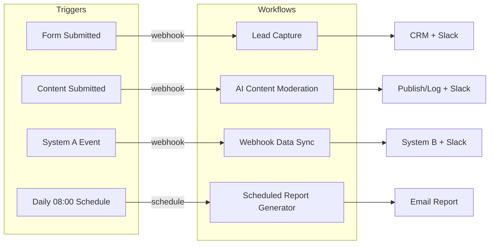

# n8n Automation Toolkit

A curated collection of production-style [n8n](https://n8n.io) workflows demonstrating automation and integration skills — form/lead handling, AI-assisted content moderation, scheduled reporting, and idempotent system-to-system sync. Each workflow is documented, exported as importable JSON, and built with credentials kept out of the repo (environment variables and placeholder URLs only). This first set of four core workflows is complete; see below for what's in it.

## At a glance



Three of the four workflows are webhook-triggered (react to an external event in near real-time); the fourth runs on a daily schedule. See each workflow's own README for its full flow, including branches and error handling.

## Workflows

| Workflow | Description | Status |
|---|---|---|
| [Lead Capture](workflows/lead-capture/README.md) | Webhook-triggered intake that validates form data, pushes leads to a CRM, and notifies a Slack channel — with fallback notification if the CRM call fails | ✅ Available |
| [AI Content Moderation](workflows/ai-content-moderation/README.md) | LLM-classified first-pass review that auto-publishes approved content, routes flagged/rejected content to Slack for human follow-up, and fails safe to human review if the LLM call or parse fails | ✅ Available |
| [Scheduled Report Generator](workflows/scheduled-report-generator/README.md) | Daily cron-triggered database query that summarizes new signups with a day-over-day comparison and emails an HTML report, falling back to a "generation failed" email if the query errors | ✅ Available |
| [Webhook Data Sync](workflows/webhook-data-sync/README.md) | Validates and transforms incoming System A events, upserts/deletes the matching record in System B with an idempotency lookup to guard against duplicate webhook retries, and retries with a Slack alert if the write still fails | ✅ Available |

## Repository structure

```
n8n-automation-toolkit/
├── workflows/
│   ├── lead-capture/
│   │   ├── workflow.json   # Importable n8n workflow export
│   │   └── README.md       # Workflow-specific documentation
│   ├── ai-content-moderation/
│   │   ├── workflow.json   # Importable n8n workflow export
│   │   └── README.md       # Workflow-specific documentation
│   ├── scheduled-report-generator/
│   │   ├── workflow.json   # Importable n8n workflow export
│   │   └── README.md       # Workflow-specific documentation
│   └── webhook-data-sync/
│       ├── workflow.json   # Importable n8n workflow export
│       └── README.md       # Workflow-specific documentation
├── .env.example             # Environment variables referenced by workflows (placeholders only)
└── README.md                 # This file
```

## Security & Credentials

- **Every `workflow.json` in this repo is safe to share publicly.** They contain no real API keys, tokens, passwords, or webhook URLs — only placeholder endpoints (e.g. `api.example-crm.com`), `$env.VARIABLE_NAME` expressions, and, where a workflow uses n8n's built-in credential system (Postgres, SMTP), a generic credential *reference* (a placeholder id/name) rather than the credential itself. n8n never exports real credential values into workflow JSON by design, and this repo doesn't add any on top of that. See each workflow's README for the specific variables it needs, and [.env.example](.env.example) for the full list.
- **Setting up real credentials locally:**
  1. Copy [.env.example](.env.example) to `.env` and fill in real values for the workflow(s) you're using.
  2. For values consumed directly by node expressions (e.g. `$env.CRM_API_KEY`, `$env.SLACK_WEBHOOK_URL`), make sure your n8n instance loads that `.env` file (or set the variables in your instance's environment directly).
  3. For values used via n8n's Credentials UI (Postgres, SMTP), use `.env.example`'s values as a reference for what to enter when creating that credential in n8n — those variables document the expected values, they aren't read automatically by the credential system.
- **Never commit a real `.env` file.** `.gitignore` excludes `.env` and common n8n credential-export artifacts, but that's a safety net, not a substitute for checking `git status`/`git diff` before committing if you've been testing locally with real credentials.
