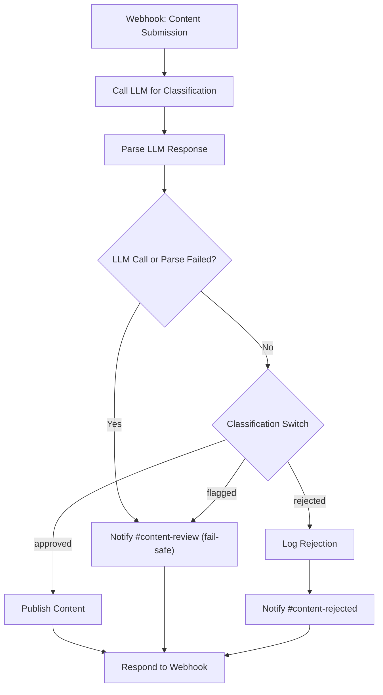

# AI Content Moderation

## Problem it solves

User-submitted content (comments, posts, listings, etc.) usually needs a first-pass review before it goes live, and doing that entirely by hand doesn't scale — moderators end up reading everything, including the large share of submissions that are obviously fine. This workflow automates that first pass: an LLM classifies each submission as `approved`, `flagged`, or `rejected` with a short reason, then the workflow routes it accordingly — publishing clean content automatically, sending borderline content to a human review channel, and logging + flagging clearly bad content — so moderators only spend time on the content that actually needs a human judgment call.

## Flow diagram

A failed or unparsable LLM call (top path) and a normal `flagged` classification (bottom path) both land on the same **Notify #content-review** node — the fail-safe reuses the regular human-review channel rather than needing a separate alert path.

## Nodes used

| Node | Purpose |
|---|---|
| Webhook - Content Submission | Trigger. Receives POST with `content_id`, `text`, `author_id` |
| Call LLM for Classification | HTTP Request to a placeholder LLM endpoint. Asks the model to return `{"classification": "approved\|flagged\|rejected", "reason": "..."}`. `continueOnFail` is enabled so an LLM outage doesn't kill the run |
| Parse LLM Response | Code node — parses the model's JSON reply. Any failure (HTTP error, unparsable JSON, or an unrecognized classification value) is caught and rewritten as `classification: "flagged"` with `llmFailed: true` |
| LLM Call or Parse Failed? | IF node — the explicit fail-safe gate. When `llmFailed` is true, it routes straight to human review, bypassing classification-based branching entirely |
| Classification Switch | Switch node — routes successfully-classified content to the `approved` / `flagged` / `rejected` branch |
| Publish Content (placeholder) | HTTP Request to a mock "publish" endpoint for approved content |
| Notify #content-review (Slack placeholder) | HTTP Request to a Slack webhook — used both for normal `flagged` content and for the LLM-failure fail-safe path. Includes the content text and the reason |
| Log Rejection (placeholder) | HTTP Request to a mock logging endpoint for rejected content |
| Notify #content-rejected (Slack placeholder) | HTTP Request to a Slack webhook announcing the rejection |
| Respond to Webhook | Returns a JSON acknowledgment (`content_id`, final `classification`) to the caller |

## How to import into n8n

1. In n8n, go to **Workflows → Add Workflow → Import from File** (or **⋮ → Import from File** on the workflows list).
2. Select [workflow.json](workflow.json) from this folder.
3. The workflow will appear with all 10 nodes and connections wired up, but **no credentials attached** — see setup below before activating it.

## Credentials & setup needed

This workflow ships with no real secrets. It reads two values from environment variables at execution time (see the root [.env.example](../../.env.example)):

| Variable | Used by | Purpose |
|---|---|---|
| `LLM_API_KEY` | Call LLM for Classification node | Sent as the `x-api-key` header |
| `CONTENT_MODERATION_SLACK_WEBHOOK_URL` | Notify #content-review / #content-rejected nodes | Slack incoming webhook URL the moderation notifications are posted to |

Setup steps:

1. Set `LLM_API_KEY` and `CONTENT_MODERATION_SLACK_WEBHOOK_URL` in your n8n instance's environment.
2. Replace `REPLACE_WITH_YOUR_MODEL` in the **Call LLM for Classification** node body with the actual model identifier for your LLM provider, and adjust the endpoint/headers if you're not using the Anthropic Messages API shape assumed here.
3. Replace the placeholder ContentPass-style URLs (`https://api.example-contentpass.com/...`) in **Publish Content** and **Log Rejection** with your real publishing/logging endpoints.
4. Create a Slack incoming webhook for moderation notifications and put that URL in `CONTENT_MODERATION_SLACK_WEBHOOK_URL`. The workflow sets a `channel` field per message (`#content-review`, `#content-rejected`) as a best-effort override — modern Slack incoming webhooks are bound to a single channel at creation time, so if you need two distinct channels, create two webhooks and split the variable (e.g. `..._REVIEW_URL` / `..._REJECTED_URL`) in your own copy.
5. Activate the workflow and point your content-submission system at the Webhook node's production URL.

## Fail-safe behavior

If the LLM call fails outright, times out, or returns something that isn't valid JSON in the expected shape, the workflow does **not** silently drop the item and does **not** auto-approve it. The **Parse LLM Response** node catches every failure mode and forces `classification: "flagged"`, and the **LLM Call or Parse Failed?** IF node explicitly routes that case straight to the `#content-review` Slack notification for human review — the same as a normal "flagged" result. Auto-publishing only ever happens when the LLM successfully returned an explicit `"approved"` classification.
