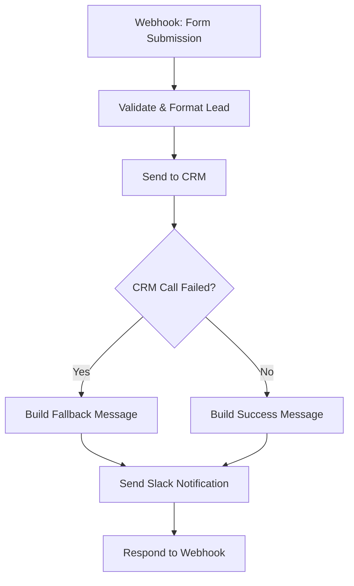

# Lead Capture

## Problem it solves

Website contact/lead forms are often just an email that lands in an inbox and gets triaged manually — leads sit unread, get lost, or take hours to reach the right channel. This workflow automatically captures a form submission the moment it arrives, validates and formats the data, pushes it into a CRM, and notifies the sales/support team in Slack — with no manual step in between. If the CRM push fails, the team still gets notified so no lead falls through the cracks.

## Flow diagram



## Nodes used

| Node | Purpose |
|---|---|
| Webhook - Form Submission | Trigger. Receives POST with `name`, `email`, `message` |
| Validate & Format Lead | Code node — trims input, validates email format, throws on invalid data |
| Send to CRM (placeholder) | HTTP Request to a mock CRM endpoint. `continueOnFail` is enabled so a CRM outage doesn't kill the run |
| CRM Call Failed? | IF node — branches on whether the CRM call errored |
| Build Fallback Message / Build Success Message | Set nodes — compose the Slack message text for each branch |
| Send Slack Notification (placeholder) | HTTP Request to a Slack incoming webhook URL, sent either way |
| Respond to Webhook | Returns a JSON acknowledgment to whoever submitted the form |

## How to import into n8n

1. In n8n, go to **Workflows → Add Workflow → Import from File** (or **⋮ → Import from File** on the workflows list).
2. Select [workflow.json](workflow.json) from this folder.
3. The workflow will appear with all 8 nodes and connections wired up, but **no credentials attached** — see setup below before activating it.

## Credentials & setup needed

This workflow intentionally ships with no real secrets. It reads two values from environment variables at execution time (see the root [.env.example](../../.env.example)):

| Variable | Used by | Purpose |
|---|---|---|
| `CRM_API_KEY` | Send to CRM node | Sent as `Authorization: Bearer <value>` header |
| `SLACK_WEBHOOK_URL` | Send Slack Notification node | Full Slack incoming webhook URL to post the message to |

Setup steps:

1. Set `CRM_API_KEY` and `SLACK_WEBHOOK_URL` in your n8n instance's environment (self-hosted: `.env` file or process environment; n8n Cloud: use Variables or Credentials as appropriate).
2. Replace the placeholder CRM URL (`https://api.example-crm.com/leads`) in the **Send to CRM** node with your real CRM's leads endpoint, and adjust the request body/headers to match its API.
3. Create a real Slack incoming webhook (Slack → Apps → Incoming Webhooks) and put that URL in `SLACK_WEBHOOK_URL` — do not paste it directly into the node.
4. Activate the workflow and point your form's submission handler at the Webhook node's production URL.

## Fallback behavior

If the **Send to CRM** node fails (outage, timeout, bad credentials, etc.), the workflow does not fail silently. `continueOnFail` lets execution continue past the error, the **CRM Call Failed?** IF node detects it, and **Build Fallback Message** composes a Slack message that explicitly flags the CRM push as failed instead of the normal success message. Either way, **Send Slack Notification** still fires and **Respond to Webhook** still acknowledges the submission — the sales/support team always hears about the lead, even when the CRM write breaks.

## Testing

Send a test POST request to the webhook (replace the URL with your local/dev n8n webhook URL):

```bash
curl -X POST https://<your-n8n-host>/webhook/lead-capture \
  -H "Content-Type: application/json" \
  -d '{"name": "Jane Doe", "email": "jane@example.com", "message": "Interested in a demo"}'
```

Submitting without a valid `name` or `email` will cause the Validate & Format Lead node to throw, so you can confirm error handling behaves as expected in the n8n execution log.
