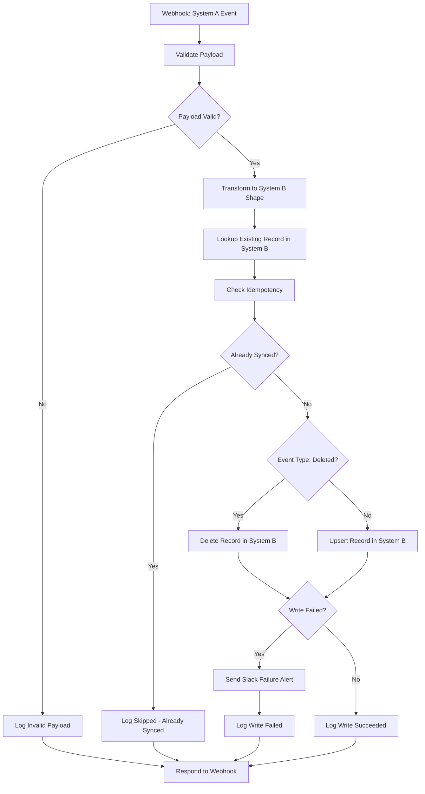

# Webhook Data Sync

## Problem it solves

Keeping two systems in sync usually means either polling one of them constantly (wasteful and laggy) or standing up a dedicated integration service (real engineering effort for what's often a simple "when X changes, update Y" rule). This workflow does it with a webhook instead: System A (a CRM, content platform, etc.) pushes an event the moment a record is created, updated, or deleted, and the workflow validates it, reshapes it for System B, and writes it over — near real-time, with no polling and no custom service to maintain. It also treats webhook delivery honestly: webhooks are typically retried by the sender ("at-least-once" delivery), so the workflow checks before it writes to avoid turning a retried delivery into a duplicate write.

## Flow diagram

## Nodes used

| Node | Purpose |
|---|---|
| Webhook - System A Event | Trigger. Receives POST with `id`, `type` (`created`/`updated`/`deleted`), `data` |
| Validate Payload | Code node — checks `id`/`type`/`data` shape; never throws, just marks the item valid or invalid |
| Payload Valid? | IF node — routes invalid payloads straight to a logged rejection instead of continuing |
| Log Invalid Payload | Set node — records the rejection reason for the response |
| Transform to System B Shape | Code node — maps System A's field names to System B's (`full_name`→`name`, `email`→`email_address`, etc.) and normalizes `updated_at` to ISO-8601 as `synced_version` |
| Lookup Existing Record in System B | HTTP Request (GET, placeholder endpoint) — fetches System B's current state for this entity. Uses `neverError`/`fullResponse` so a 404 (record not found) is read as data, not treated as a crash |
| Check Idempotency | Code node — the idempotency safeguard. Compares System B's current `synced_version` (or existence, for deletes) against what we're about to write, and marks the item as already-synced when nothing would change |
| Already Synced? | IF node — skips the write entirely when Check Idempotency found nothing to do |
| Log Skipped - Already Synced | Set node — records the no-op for the response |
| Event Type: Deleted? | IF node — routes `deleted` events to the delete call and `created`/`updated` events to the upsert call |
| Delete Record in System B | HTTP Request (DELETE, placeholder endpoint). `retryOnFail` is enabled |
| Upsert Record in System B | HTTP Request (PUT, placeholder endpoint) with the transformed payload as the body. `retryOnFail` is enabled |
| Write Failed? | IF node — after the write node's retries are exhausted, routes to the failure-alert path or the success path |
| Send Slack Failure Alert | HTTP Request to a placeholder Slack webhook — sent only when the write still failed after retries. Includes the entity id, event type, error, and the payload that failed to write, so nothing is silently lost |
| Log Write Failed / Log Write Succeeded | Set nodes — normalize the outcome into `status`/`message`/`entity_id` for the response |
| Respond to Webhook | Returns a JSON acknowledgment (`status`, `message`, `entity_id`) to System A for every path — rejected, skipped, synced, or failed-and-alerted |

## How to import into n8n

1. In n8n, go to **Workflows → Add Workflow → Import from File** (or **⋮ → Import from File** on the workflows list).
2. Select [workflow.json](workflow.json) from this folder.
3. The workflow will appear with all 17 nodes and connections wired up, but **no credentials attached** — see setup below before activating it.

## Configuring both systems' credentials

1. **System A (source)** — no credential is needed on this side; System A just needs to be configured to POST its `created`/`updated`/`deleted` events to this workflow's Webhook node production URL, with a body shaped like `{"id": "...", "type": "created", "data": {...}}`.
2. **System B (destination)** — the **Lookup**, **Delete**, and **Upsert** HTTP Request nodes all send `Authorization: Bearer {{ $env.SYSTEM_B_API_KEY }}`. Set `SYSTEM_B_API_KEY` in your n8n environment, and replace the placeholder URLs (`https://api.example-systemb.com/records/...`) with System B's real endpoints — adjust the request shape to match its actual API (this workflow assumes a REST-ish `GET/PUT/DELETE /records/{id}` API returning `{external_id, synced_version, ...}`).
3. **Failure alerts** — create a Slack incoming webhook for sync failures and set `SYNC_FAILURE_SLACK_WEBHOOK_URL` to its URL.
4. Adjust the field mapping in **Transform to System B Shape** to match your actual System A / System B schemas.
5. Activate the workflow.

## Credentials & environment variables needed

This workflow ships with no real secrets — placeholder endpoints and env var expressions only. See the root [.env.example](../../.env.example):

| Variable | Used by | Purpose |
|---|---|---|
| `SYSTEM_B_API_KEY` | Lookup / Delete / Upsert nodes | Sent as the `Authorization: Bearer` header on every call to System B |
| `SYNC_FAILURE_SLACK_WEBHOOK_URL` | Send Slack Failure Alert node | Slack incoming webhook URL for sync-failure alerts |

## Idempotency approach — and why it matters here

Webhooks are almost always delivered **at-least-once**: if System A doesn't get a fast enough acknowledgment, times out, or retries after a network blip, the same event can arrive twice (or more). Writing on every delivery without checking first means duplicate writes are a "when," not an "if."

Before writing, this workflow does a cheap `GET` against System B for the entity and compares what's there to what it's about to write:

- For `created`/`updated` events, "already synced" means System B's `synced_version` already matches the version we'd write — so a retried webhook for the same change is a safe no-op.
- For `deleted` events, "already synced" means the record is already gone from System B — so a retried delete doesn't error out on a record that's no longer there.
- If the lookup itself fails unexpectedly (not just a normal "not found"), the workflow **fails open** and proceeds with the write rather than risking a legitimate sync getting silently skipped — a possible duplicate write is judged safer than a silently dropped one.

This keeps retries safe without needing System B to support upsert-by-idempotency-key natively, and without the workflow needing to track delivery IDs itself.

## Failure fallback behavior

The **Upsert**/**Delete** HTTP Request nodes have `retryOnFail` enabled (4 attempts, 2s between tries) to absorb transient failures on their own. If the write still fails after retries, the workflow does not fail silently: **Write Failed?** catches it, **Send Slack Failure Alert** posts the entity id, event type, error, and the exact payload that failed to write to Slack, and **Respond to Webhook** still returns a `sync_failed` status to System A. Nothing gets dropped without a human being notified.
